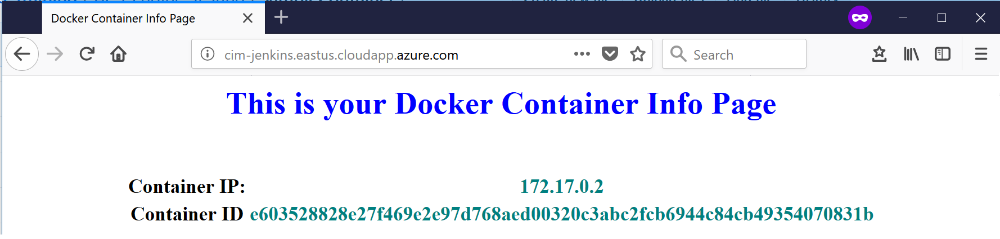
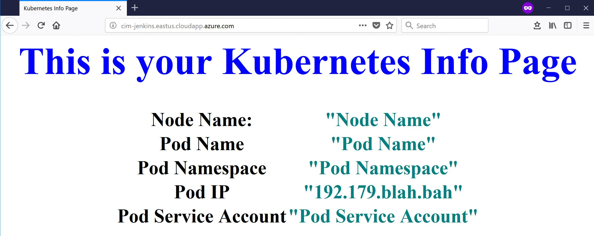

# Kubernetes In Action
In this section we are going to perform the following:
1. [**Deploy an info-app container**](#deploy-an-info-app-container)
    * [Test Docker info-app container](#test-docker-info-app-container)
    * [Test Kubernetes info-app container](#test-kubernetes-info-app-container)
2. [**Deploy an info-app Kubernetes Pod**](#deploy-an-info-app-kubernetes-pod)
3. [**Deploy an info-app Kubernetes Replication Controller**](#deploy-an-info-app-kubernetes-replication-controller)
4. [**Deploy an info-app Kubernetes Service**](#deploy-an-info-app-kubernetes-service)
5. [**Deploy an info-app Kubernetes Deployment**](#deploy-an-info-app-kubernetes-deployment)
6. [**Push an enhanced version of info-app**](#push-an-enhanced-version-of-info-app)

## Prerequsites
### Before beginning ensure docker is installed. To do so follow [these instructions.](https://docs.docker.com/install/)
### Download Git Repository
```bash
git clone https://github.com/alihhussain/Kubernetes_Training.git
```
### Change working directory to Git cloned repo
```bash
cd ./Kubernetes_Training
```

### Access to a Kubernetes Environment
There are a number of ways to do get a Kubernetes environment.
1. [Deploy an AKS Cluster](https://docs.microsoft.com/en-us/azure/aks/kubernetes-walkthrough)
2. [Deploy a cluster via ACS-Engine](https://github.com/Azure/acs-engine/blob/master/docs/kubernetes/deploy.md)
3. [Access Kubernetes API locally vis Minikube](https://github.com/kubernetes/minikube#minikube)

## Deploy an info-app container
Lets build and test the info-app container locally.
### Test Docker info-app container
1. Build the docker image locally.
```bash
# Make sure you cd into the cloned repo directory
cd ./Kubernetes_Training

docker build -t="your_docker_hub_username/your_docker_hub_repo:tag" ./ACS-Engine_Testing/sampleContainer/
```
2. Run a container based on the image
```bash
docker run -d -p 80:80 --name info-app your_docker_hub_username/your_docker_hub_repo:tag
```
3. Test the container via curl 
```bash
curl http://localhost:80

#Sample Output
<!DOCTYPE html>
<html lang="en">

<head>
    <meta charset="UTF-8">
    <meta name="viewport" content="width=device-width, initial-scale=1.0">
    <meta http-equiv="X-UA-Compatible" content="ie=edge">
    <title>Docker Container Info Page</title>
    <link rel="stylesheet" href="/static/docker.css">
...
```
4. Test the container via browser: Visit [http://localhost:80](http://localhost:80)


### Test Kubernetes info-app container
* Prerequisite

Ensure you cd into the cloned repository.
```bash
# Make sure you cd into the cloned repo directory
cd ./Kubernetes_Training
```
Ensure the previously created container (*info-app*) is deleted.
```bash
docker stop info-app && docker rm info-app
```

1. Run a container based on the image
```bash
docker run -d -p 80:80 --name info-app --env-file ./ACS-Engine_Testing/sampleContainer/env.list your_docker_hub_username/your_docker_hub_repo:tag
```
2. Test the container via curl 
```bash
curl http://localhost:80

#Sample Output
<!DOCTYPE html>
<html lang="en">

<head>
    <meta charset="UTF-8">
    <meta name="viewport" content="width=device-width, initial-scale=1.0">
    <meta http-equiv="X-UA-Compatible" content="ie=edge">
    <title>Kubernetes Info Page</title>
    <link rel="stylesheet" href="/static/k8s.css">
...
```
5. Test the container via browser: Visit [http://localhost:80](http://localhost:80)



## Deploy an info-app Kubernetes Pod
Once you have access to a [Kubernetes environment](#access-to-a-kubernetes-environment), ensure you can access the cluster by running: ```kubectl create -f ./ACS-Engine_Testing/sampleContainer/k8s/info-po.yaml```

Sample Output:
```bash
[K8sInAction]$ kubectl get nodes
NAME                    STATUS    ROLES     AGE       VERSION
k8s-agent-35640035-0    Ready     agent     5d        v1.7.9
k8s-agent-35640035-1    Ready     agent     5d        v1.7.9
k8s-agent-35640035-2    Ready     agent     5d        v1.7.9
k8s-master-35640035-0   Ready     master    5d        v1.7.9
```
Deploy the pod by running:
```bash
#Insure your working directory is the downloaded Git Repo
cd ./Kubernetes_Training

[Kubernetes_Training]$ kubectl create -f ./ACS-Engine_Testing/sampleContainer/k8s/info-po.yaml
pod "flask-info-app" created
```
## Deploy an info-app Kubernetes Replication Controller
## Deploy an info-app Kubernetes Service
## Deploy an info-app Kubernetes Deployment